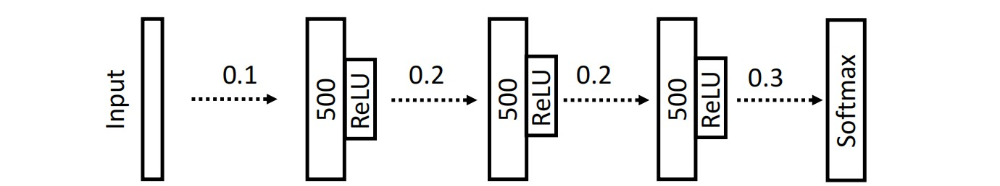
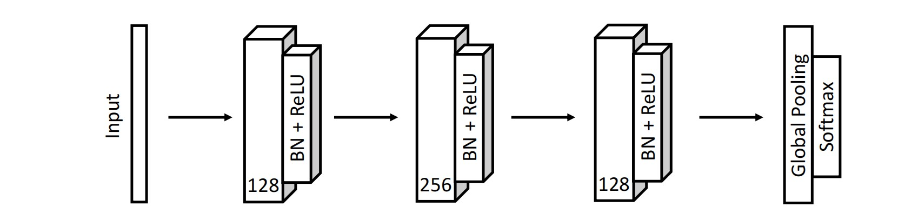
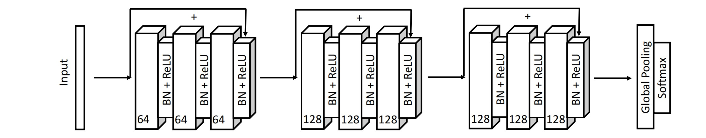
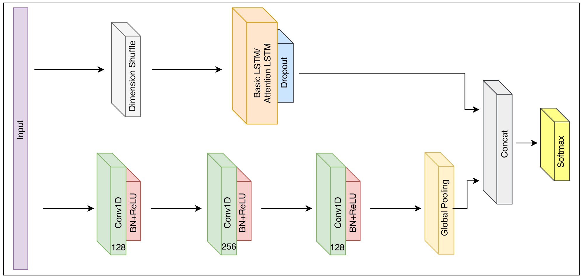
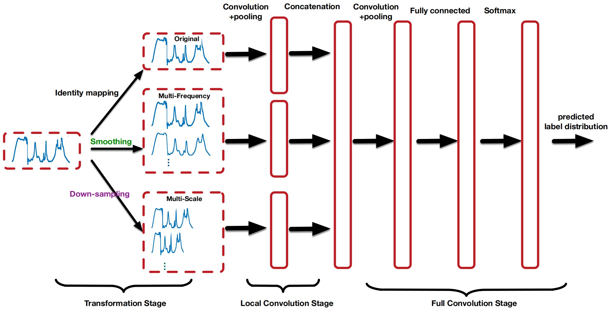
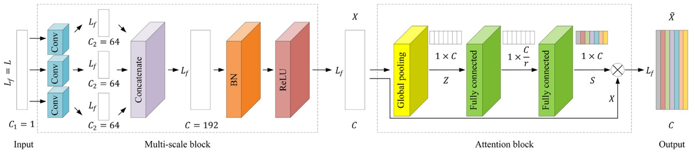
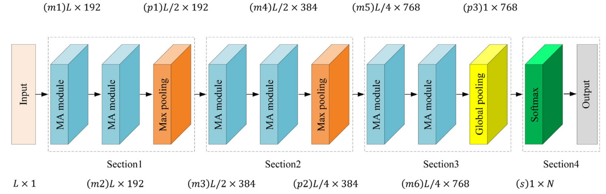
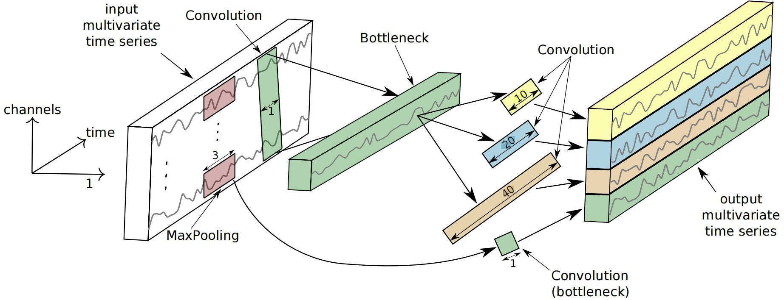
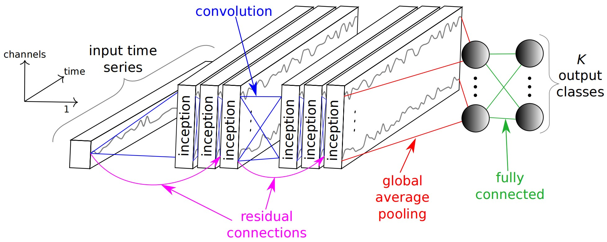

# Classic Deep Learning Method in Time Series Classification

将UCRArchive文件夹放在当前目录下，直接运行del.ipynb即可

## 时间序列分类

时间序列分类任务是指对时间序列数据进行分类的问题。在这种任务中，数据点的观测值是按时间顺序排列的，目标是根据这些观测值将序列分配到预定义的类别中。这类任务在许多领域都有应用，包括金融、医学、生态学、工业生产等。在TSC任务中，关键的挑战之一是考虑到时间的顺序性，因为模型需要理解和利用观测值之间的时序关系。因此，专门设计用于处理时间序列的模型在这类任务中通常表现更好。

### MLP 多层感知机

多层感知器是一种人工神经网络（ANN），它由多个神经元层组成，包括输入层、隐藏层和输出层。在时间序列分类问题中，MLP被用作一种机器学习模型，用于学习时间序列数据中的模式并进行分类。该网络中的每个神经元与前一层的每个神经元相连，每个连接都有一个权重。在训练过程中，权重被调整以最小化模型的预测误差。MLP使用激活函数来引入非线性性，以便学习复杂的模式。

在时间序列分类中，输入层通常对应于时间步骤上的观测值，输出层对应于分类标签。通过调整网络的参数，MLP能够学习输入时间序列与相应标签之间的关系，从而在新的未见数据上进行准确的分类。

该网络主要通过学习全连接的权重来实现建模，并通过激活函数实现非线性变化。但是该模型的一个重要缺陷在于无法很好的捕获每个时间戳的相关性。**MLP会对每一个输入的时间戳进行单独处理，学习到自己的权重，将时间序列彼此独立处理。**

本文中使用的MLP网络结构如下所示，为了避免过拟合，提高神经网络的拟合能力，我们使用了Dropout操作，其p值在网络中以标出，并使用了ReLU激活函数，并在最后使用了Softmax操作完成了分类任务。

### FCN 全卷积神经网络

全卷积神经网络最初是为图像分割任务设计的，但在时间序列分类任务中也取得了不错的效果。以下是全卷积神经网络在时间序列分类中的一些特点：

1. **平移不变性：** 卷积神经网络 (CNN) 的主要优势之一是对平移不变性的学习。在时间序列中，这意味着模型能够学习不同时间点上的模式，而不受它们出现的确切时间的影响。这对于时间序列分类问题非常重要，因为模型需要能够识别相同的模式，无论它们在时间轴上的具体位置。
2. **局部特征学习：** FCN能够自动学习时间序列中的局部特征，这使得模型能够更好地捕捉输入数据中的重要模式。卷积层在每个时间步上都对数据进行滑动窗口的处理，从而使得网络能够感知到输入序列中的局部结构。
3. **端到端学习：** FCN通常是端到端学习的结构，允许模型从原始输入数据中直接学习特征表示和分类任务，而不需要手动提取特征。这样的结构使得模型更加适应不同的时间序列模式，而无需预先定义的特征工程。
4. **适用于变长序列：** FCN可以处理不同长度的时间序列，因为卷积层的窗口可以根据输入序列的长度进行相应的调整。这使得模型在应对各种长度的时间序列数据时更为灵活。
5. **空间局部性：** 虽然最初设计用于处理图像数据的卷积操作，但在时间序列中，可以将时间步视为空间维度。这种处理方式使得卷积神经网络能够有效地捕获时间序列中的局部结构和模式。

下面是本文中使用的全卷积网络的主要架构，在最后我们使用了全局池化操作汇聚全卷积网络提取的主要特征，也使得网络能够变相的处理不同长度的神经网络。期间我们使用了Batch Norm批量归一化操作以及ReLU激活函数。

**卷积可以看作是时间序列上应用的滑动滤波器。**

### ResNet 1d残差卷积网络

残差网络ResNet最初是为图像分类任务设计的，但它的思想也可以应用于时间序列分类。以下是ResNet在时间序列分类中的一些特点：

1. **残差块：** ResNet引入了残差块的概念，其中每个块包含了跨越层的“跳跃连接”（skip connection）。这种连接使得信息可以直接从一个块传递到后续块，从而更容易学习到恒等映射（identity mapping），减轻了训练深度网络时的梯度消失问题。
2. **解决梯度消失问题：** 通过引入跳跃连接，ResNet成功缓解了训练非常深层网络时可能出现的梯度消失问题。这种设计允许网络更轻松地学习恒等映射，即输入可以直接传递到输出，从而使网络更容易优化。
3. **深度网络：** ResNet通常包含数十甚至数百个层，这种深度使得网络能够学习更复杂的特征和表示。在时间序列分类中，这有助于模型更好地捕捉输入序列中的抽象和高级模式。
4. **逐层特征学习：** ResNet通过跳跃连接的方式实现了逐层特征学习。每个残差块的输出是由其输入和残差学习模块计算而来，这有助于网络逐层地学习输入序列的表示。

在应用ResNet进行时间序列分类时，需要根据具体问题的性质和数据的特点来调整网络架构和超参数。尽管ResNet最初是为图像任务设计的，但其设计原理在时间序列领域的成功应用证明了其在多个领域的通用性。下图为本文中使用的ResNet网络结构：

### LSTM-FCN 长短期记忆网络+全卷积网络

LSTM-FCN（Long Short-Term Memory - Fully Convolutional Network）是一种将长短时记忆网络（LSTM）和全卷积神经网络（FCN）结合起来的模型，用于解决时间序列分类问题。这种结合的方式旨在克服传统方法在捕捉长期依赖和局部特征方面的一些限制。以下是LSTM-FCN的一些关键特点：

1. **LSTM层：** LSTM是一种递归神经网络（RNN）的变体，专门设计用来处理序列数据中的长期依赖关系。在LSTM-FCN中，LSTM层用于捕捉输入序列中的时间依赖性，允许网络学习到数据中的长期模式。
2. **FCN层：** FCN部分是一个全卷积神经网络，用于学习输入序列中的局部特征。FCN可以在不同的时间尺度上捕捉序列中的模式，对于一些局部结构的学习更为有效。这有助于提供对不同时间尺度的适应性。
3. **多尺度特征融合：** LSTM-FCN能够在不同的时间尺度上捕捉特征，通过融合LSTM和FCN的输出，使模型能够综合考虑长期和短期的依赖关系。这有助于更全面地理解序列中的模式。
4. **端到端学习：** LSTM-FCN通常是端到端学习的结构，无需手动提取特征。这使得模型更具有灵活性，可以直接从原始序列数据中学习适用于分类任务的特征表示。
6. **适应变长序列：** LSTM层的一个优点是它可以适应不同长度的序列，因此LSTM-FCN在处理变长序列时更为灵活。

LSTM-FCN的结合旨在克服LSTM和FCN各自的一些缺点，使模型能够更好地应对时间序列分类问题。这种结合的方法使得模型在捕捉长期依赖关系和局部特征方面具有更好的性能，适用于多种时间序列应用场景，如股票预测、生物医学信号分类等。本文中使用的LSTM-FCN结构如下图所示：

### MCNN 多尺度卷积网络

多尺度卷积神经网络（Multiscale Convolutional Neural Network，MCNN）是一种用于时间序列分类的神经网络结构，其主要特点是在不同时间尺度上使用卷积操作，以便同时捕捉不同时间尺度上的特征。以下是多尺度卷积神经网络的一些关键特点：

1. **多通道卷积：** MCNN通常包含多个卷积通道，每个通道使用不同大小的卷积核。这样的设计使得网络能够同时捕捉不同时间尺度上的局部特征，从而更全面地理解输入序列中的模式。
2. **卷积核的尺寸：** MCNN使用不同大小的卷积核来处理输入序列。较小的卷积核有助于捕捉短期模式，而较大的卷积核则可以捕捉更长时间尺度上的模式。这种多尺度的设计使得网络能够对序列中的不同时间范围内的模式进行建模。
3. **子采样和池化：** MCNN中常常包括子采样和池化操作，以减小特征图的尺寸。这有助于减小模型的计算复杂性，并提取更显著的特征。
4. **通道的融合：** MCNN通常会在不同尺度的卷积通道上学习特征，并通过一些操作（如拼接或加权求和）将这些通道融合在一起，形成最终的特征表示。这种融合允许网络综合考虑不同时间尺度上的信息。
6. **端到端学习：** MCNN通常是端到端学习的结构，允许模型直接从原始输入数据中学习适用于时间序列分类的特征表示，而无需手动提取特征。

多尺度卷积神经网络的优势在于能够同时捕捉序列中的不同时间尺度上的特征，从而提高对序列数据中模式的感知能力。这种结构在处理具有多个时间尺度上的动态模式的问题时表现得特别有效，本文中使用的多尺度卷积神经网络如下所示：

### MACNN 多尺度SE注意力卷积网络

MACNN是除了InceptionTime网络外我最认同的一种网络结构，该网络结构融合了MCNN的多尺度卷积思想，能够学习一段时间序列不同时间尺度的特征。

由于Transformer结构中的自注意力和多头注意力机制在时间序列分类中并不高效，该结构利用了计算机视觉领域中常用的SE通道注意力机制。该方法具有较低的模型复杂度和计算复杂度，能够更高效的计算每个卷积通道的重要性并根据此重新分配注意力。

MACNN中使用的多尺度模块和网络结构如下图所示：

### InceptionTime 时间序列分类中的Alex结构

InceptionTime是一种用于时间序列分类任务的神经网络，它基于Inception模块的设计思想，旨在有效地捕捉不同尺度上的时间序列特征。以下是InceptionTime网络的一些关键特点：

1. **Inception模块：** InceptionTime的核心是借鉴了Inception模块，该模块最初是为图像分类任务设计的。在时间序列领域，Inception模块被用于同时捕捉不同时间尺度上的特征。这通过使用多个不同大小的卷积核来实现，使网络能够在局部和全局尺度上捕捉模式。
2. **多尺度卷积：** InceptionTime使用不同尺度的卷积核，类似于多尺度卷积神经网络（MCNN），以便同时考虑不同时间尺度上的特征。这有助于提高网络对于序列中不同时间尺度模式的敏感性。
3. **扩展模块：** InceptionTime中可能包含一些扩展模块，如快速局部相位（Depthwise Separable Convolution）卷积，用于提高模型的表示能力和效率。
4. **全局平均池化：** InceptionTime通常采用全局平均池化，将每个通道上的特征进行平均，得到一个固定长度的向量，作为最终的特征表示。这有助于减小特征图的维度，提高计算效率。
6. **端到端学习：** InceptionTime是端到端学习的结构，可以直接从原始时间序列数据中学习特征表示，而无需手动提取特征。

InceptionTime网络的设计旨在充分利用卷积核在不同时间尺度上的感受野，从而提高时间序列分类任务的性能。本文中使用的Inception模块与InceptionTime网络结构如下图所示：

### UCRArchive 介绍

UCR（The UCR Time Series Classification Archive）是一个用于时间序列分类的数据集合集，由加拿大西蒙弗雷泽大学（Simon Fraser University）的Yanping Chen、Eamonn Keogh以及其他研究人员维护。该数据集用于评估时间序列分类算法的性能，并为研究人员提供一个标准化的基准，以比较不同算法的效果。以下是关于UCR数据集的一些详细介绍：

**数据集组成：**

1. **数据集数量：** UCR数据集包含大量的时间序列数据集，涵盖多个领域和应用。截至目前，该数据集包含128个不同的数据集，其中每个数据集都涉及一个或多个时间序列。

2. **领域和应用：** 这些数据集涉及的领域多种多样，包括生物医学、图像、音频、金融、运动识别、信号处理等。每个数据集通常有其独特的特征和数据结构。

**数据集特性：**

1. **时间序列长度：** 不同的数据集包含不同长度的时间序列，从几十到几千个数据点不等。

2. **类别数目：** 每个数据集都有一个或多个类别，研究目标通常是将时间序列分类到这些类别中。

3. **标签：** 每个时间序列都有一个或多个与之相关的标签，表示它所属的类别。

**评估和比较：**

1. **标准化评估：** UCR提供了标准的评估协议，包括训练集和测试集的划分，以及评估分类算法性能的标准指标，如准确性、错误率等。

2. **比较基准：** UCR数据集为研究人员提供了一个比较不同时间序列分类算法性能的基准。研究者可以在相同的数据集上比较他们的算法，并将结果与先前的研究进行比较。

**使用案例：**

1. **算法评估：** 研究人员可以使用UCR数据集来评估新的时间序列分类算法的性能。

2. **算法比较：** 研究人员可以使用UCR数据集来比较不同算法在相同数据集上的性能。

3. **应用探索：** UCR数据集中的时间序列涵盖多个领域，可以用于探索不同领域中的应用。
